# xunit-viewer


## Front end

Powered by **Create React App**.


Frontend is a React app based at [src/app/app.js](/src/app/app.js)

To be used from CLI, it's built by CRA and build output is saved in [`src/cli/static/`](src/cli/static/) directory (and commited into git without `index.html` file).

## CLI

Command line program is a Node.js file that handles command line options and outputs the Xunit html file to disk, among other things.

```mermaid
graph LR;
    subgraph static
    statis/*.js;
    static/*.css;
    end

    subgraph user input
    junit.xml
    end

    statis/*.js -->|require| CLI;
    static/*.css-->|require| CLI;

    template["Handlebars template"]--> CLI;
    
    junit.xml--> CLI;

    CLI--> Handlebars;

    Handlebars==> index.html["index.html – <i>output</i>"];

```



As you see, to make changes on the frontend, you have to make changes to React app, build it, then run CLI to output a new html file. And that's how you commit changes to the CLI.

In order to quickly test in development you need to import a sample junit file in [`index.js`](/src/index.js). Like this:

```diff
+import sampleXml from './path/to/sample.xml'

if (process.env.NODE_ENV === 'development') {
  files = [{
    file: '/path/to/file/complete.xml',
    contents: LZUTF8.compress(`
-    <?xml version="1.0" encoding="UTF-8"?>
-<testsuite tests="1" failures="1" time="0.0160106">
-  <testcase name="It Is A Failure" classname="Failing" time="0.012011200000000001">
-    <error>Error message</error>
-    <system-out>Some messgae</system-out>
-    <failure type="Failure">FILENAME:XX</failure>
-  </testcase>
-</testsuite>
+${sampleXml}
`, { outputEncoding: 'Base64' })
  }]
}
```

Where `sampleXml` is a string with contents of Junit XML file. You can import it, you can hardcode it, any means you see necessary. But before commiting you have to ensure that this change is not staged, so it won't get commited to `master` branch.
